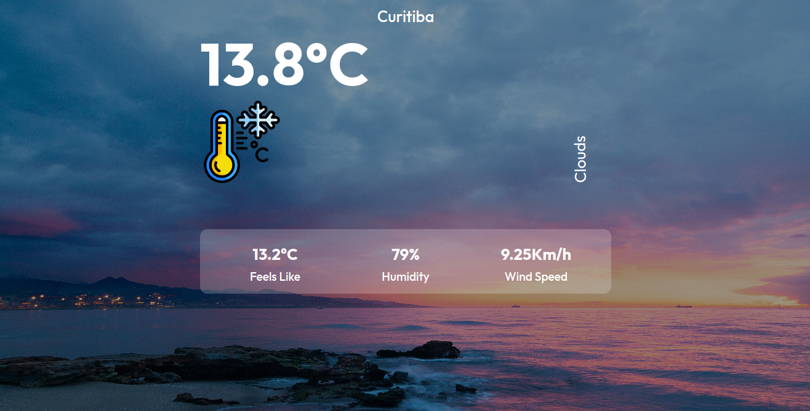

# Weather Dashboard - React 📈🖥️📊💻

> # Description 

The Weather Dashboard is a user-friendly application that provides real-time weather information by making requests to the OpenWeather API using Axios. This small yet powerful dashboard automatically detects the user's location and displays essential weather details for the current city, including:

* Current temperature in degrees Celsius (ºC) 
* Thermal sensation in degrees Celsius (ºC)
* Air humidity in percentage (%)
* Wind speed in kilometers per hour (km/h)

This project is Available here: [OpenWeather API Dashboard - Vítor F. Nery](https://weather-dashboard-vitorfnery.netlify.app/)

## Features

* Automatic Location Detection: The dashboard automatically detects the user's location, ensuring that they receive accurate weather information without having to manually enter the city name.

* Dynamic Thermometer Image: Depending on the current temperature, a visually appealing and contextually relevant thermometer image is displayed on the screen. This feature enhances the user experience and provides a quick visual representation of the weather conditions.

* Responsive Design: The page is thoughtfully styled using CSS, ensuring a seamless experience across various devices, from desktops to smartphones and tablets.

* Real-time Updates: Weather data is updated in real time every 5 minutes, ensuring that users are always presented with the most current weather information available.

## How to use

1. Open the Weather Dashboard application in your web browser.

2. Allow the application to access your location when prompted. This step is crucial for the dashboard to accurately display weather information for your current city.

3. Once the location is detected, the dashboard will load the current weather details, including temperature, thermal sensation, humidity, and wind speed, along with the corresponding thermometer image.

4. Sit back and enjoy up-to-date weather information at your fingertips!

## 🛠️ Technologies 

- React 
- CSS
- Axios
- [OpenWeather API](https://openweathermap.org/api)
- Git and Github

## Prerequisites

- Node.js
- NPM

## Installation

1. Clone the repository: `git clone git@github.com:vitorfnery/openweather-api_dashboard.git`
2. Navigate to the project directory: `cd your_project`
3. Install the dependencies: `npm install`

## Usage

- Start the development server: `npm run dev`
